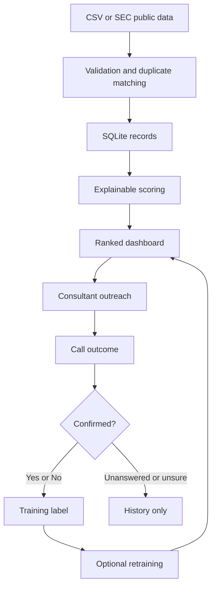

# Mensana Opportunity Radar

Mensana Opportunity Radar is a local-first prospect research and outreach application for finding Canadian and U.S. companies that may benefit from operational consulting. It combines explainable business signals, public contact information, outreach tracking, and a feedback model in one browser-based workspace.

The current release is an MVP for controlled testing. It runs locally, uses SQLite, and requires no paid API, cloud database, or AI subscription.

> **Important:** The opportunity score is a prioritization aid—not proof that a company needs consulting and not a probability unless explicitly shown as a model probability. Demo records are fictional. Verify all company, contact, and source information before outreach.

## Contents

- [Features and benefits](#features-and-benefits)
- [How it works](#how-it-works)
- [Company workflow](#company-workflow)
- [Opportunity scoring](#opportunity-scoring)
- [Feedback model](#feedback-model)
- [CSV import format](#csv-import-format)
- [Installation](#installation)
- [Using the dashboard](#using-the-dashboard)
- [Data sources](#data-sources)
- [Database and backups](#database-and-backups)
- [Testing](#testing)
- [Project structure](#project-structure)
- [API reference](#api-reference)
- [Pilot guidance](#pilot-guidance)
- [Limitations](#limitations)
- [Troubleshooting](#troubleshooting)

## Features and benefits

- Ranks Canadian and U.S. companies using a transparent 100-point opportunity score.
- Separates financial, operational, transformation, language, and company-fit signals.
- Shows plain-language evidence behind score contributions.
- Stores public phone numbers, roles, websites, source URLs, and verification dates.
- Filters leads by country, status, search text, and minimum score.
- Records call outcomes, notes, follow-up dates, meetings, and do-not-contact decisions.
- Removes contacted companies from the new-lead queue immediately to prevent repeat outreach.
- Allows accidental calls to be cancelled and companies to be re-queued when appropriate.
- Excludes cancelled, unanswered, and voicemail calls from confirmed model labels.
- Imports CSV data and selected U.S. issuer information from the SEC.
- Trains an optional local logistic-regression model from confirmed outcomes.
- Exports the current company list to CSV.

The system is explainable by default: it shows what it noticed instead of asking a consultant to trust a black-box recommendation. It is also local and inexpensive—the interface, API, database, scoring engine, and model run on the user's computer.

## How it works



1. A company enters through CSV, SEC import, or the company API.
2. The legal name and website domain are normalized.
3. Existing records are matched by SEC CIK, website domain, or normalized name and country.
4. Structured inputs become component scores and evidence statements.
5. The dashboard orders companies by final score.
6. Saving a call changes the status so the company cannot appear as a new lead again.
7. Confirmed outcomes become eligible training labels.
8. Retraining blends learned probability with the transparent heuristic score.

## Company workflow

| Status | Meaning | New queue? |
|---|---|---:|
| `NEW` | Never contacted or restored after an accidental call | Yes |
| `CONTACTED` | Outreach logged without a confirmed opportunity | No |
| `FOLLOW_UP` | A future follow-up date was recorded | No; shown in Follow-ups |
| `OPPORTUNITY` | A call confirmed a genuine opportunity | No; shown in History |
| `NO_OPPORTUNITY` | A call confirmed no current opportunity | No; shown in History |
| `DO_NOT_CONTACT` | Explicitly blocked from future outreach | No; shown in History |

### Cancelling an accidental call

Open **History**, select the company, locate the call under **Call history**, and select **Undo call**. The call stays in the database with a cancellation timestamp and reason for auditability, but it stops contributing to statistics or training. If no earlier active call remains, the company returns to `NEW`; otherwise its status is reconstructed from the latest active call.

## Opportunity scoring

The starting score is a deterministic heuristic in `app/scoring.py`:

| Component | Maximum | Inputs |
|---|---:|---|
| Financial | 30 | Margin deterioration and expenses outgrowing revenue |
| Operational | 20 | Efficiency and cost-pressure mentions |
| Transformation | 20 | Acquisition, restructuring, and management changes |
| Language | 20 | Combined relevant efficiency and cost mentions |
| Company fit | 10 | Target industry, employee count, and revenue |

### Financial score (0–30)

```text
margin pressure = max(0, -margin_change) × 3
expense pressure = max(0, expense_growth - revenue_growth) × 0.8
financial score = clamp(margin pressure + expense pressure, 0, 30)
```

A negative `margin_change` means the operating margin deteriorated. Margin pressure and expense pressure each contribute up to 15 displayed evidence points.

### Operational score (0–20)

```text
operational score = clamp(
    efficiency_mentions × 2 + cost_mentions × 2,
    0,
    20
)
```

Each mention category contributes up to 10 displayed evidence points.

### Transformation score (0–20)

| Signal | Points |
|---|---:|
| Recent acquisition | 9 |
| Restructuring | 8 |
| Management change | 5 |

The combined component is capped at 20.

### Language score (0–20)

```text
language score = clamp(
    (efficiency_mentions + cost_mentions) × 1.2,
    0,
    20
)
```

This is a lightweight signal counter in the MVP, not an LLM judgment.

### Company-fit score (0–10)

- Base 6 for an exact match to Manufacturing, Logistics, Food & Beverage, Automotive, Healthcare, or Construction.
- Base 3 for other industries.
- Add 2 when `employee_count >= 100`.
- Add 2 when `revenue >= 10,000,000`.
- Cap at 10.

Before learned training:

```text
final_score = financial + operational + transformation + language + fit
```

After training:

```text
final_score = 60% heuristic_score + 40% model_probability_as_percent
```

### Scoring cautions

- Missing numeric data behaves like zero; that does not establish that the real business value is zero.
- Operational and language components both use mention counts, so they are related.
- Industry matching currently uses exact normalized text.
- The weights are starting assumptions and are not yet empirically validated for Mensana.
- Treat scores as investigation priority, not claims of need.

## Feedback model

`app/ml.py` uses a local scikit-learn logistic regression model.

- Training requires at least 10 confirmed `YES`/`NO` calls and both outcomes.
- Cancelled calls are excluded.
- Features are standardized before classification.
- Class balancing reduces the effect of uneven outcomes.
- A 25% test split supplies an early accuracy estimate.
- The model is saved to `models/opportunity_model.joblib`.

Ten labels are only the technical minimum. For meaningful evaluation, collect at least 50 confirmed outcomes and preferably 100–200 across both countries and multiple industries. Future evaluation should include precision, recall, a confusion matrix, and performance by industry—not accuracy alone.

## CSV import format

Use `data/company-import-template.csv`. Save it as UTF-8 CSV with one company per row. Keep the header names unchanged; blank optional cells are allowed.

| Column | Required | Format and meaning |
|---|:---:|---|
| `legal_name` | Yes | Official name, e.g. `Example Manufacturing Inc.` |
| `country` | Yes | Exactly `CA` or `US` |
| `industry` | Recommended | Consistent label such as `Manufacturing` or `Logistics` |
| `website` | Recommended | Official URL, preferably including `https://` |
| `phone` | Recommended | Public business number such as `+1 416 555 0100` |
| `phone_type` | No | `Main office`, `Investor relations`, etc. |
| `phone_source` | Recommended | Where the number came from |
| `contact_name` | No | Publicly verified person; leave blank rather than guessing |
| `contact_role` | Recommended | Relevant role such as `COO` or `VP Operations` |
| `email` | No | Publicly verified business email |
| `ticker` | No | Ticker without exchange prefix |
| `cik` | U.S. public companies | SEC CIK; padded to 10 digits by the app |
| `revenue_growth` | Recommended | Percent change; `8.1` means +8.1% |
| `margin_change` | Recommended | Percentage-point change; `-4.2` means margin fell 4.2 points |
| `expense_growth` | Recommended | Percent change in the selected expense measure |
| `recent_acquisition` | Recommended | `1` if verified, otherwise `0` |
| `restructuring` | Recommended | `1` if verified, otherwise `0` |
| `management_change` | Recommended | `1` if verified, otherwise `0` |
| `efficiency_mentions` | Recommended | Non-negative integer count from reviewed sources |
| `cost_mentions` | Recommended | Non-negative integer count from reviewed sources |
| `employee_count` | No | Whole number |
| `revenue` | No | Dollars with no `$` sign or commas |
| `source_url` | Recommended | Filing, annual report, or authoritative evidence page |

Example:

```csv
legal_name,country,industry,website,phone,phone_type,phone_source,contact_name,contact_role,email,ticker,cik,revenue_growth,margin_change,expense_growth,recent_acquisition,restructuring,management_change,efficiency_mentions,cost_mentions,employee_count,revenue,source_url
Example Manufacturing Inc.,US,Manufacturing,https://example.com,+1 555 010 1000,Main office,Official company website,Jordan Lee,COO,,EXM,0000000001,8.1,-4.2,16.0,1,0,1,5,3,2400,680000000,https://example.com/investors
```

### Import rules

- `legal_name` and supported `country` are mandatory.
- Do not put commas, percent signs, or currency symbols in numeric fields.
- Use `1` and `0` for boolean signals.
- Do not invent contacts, numbers, emails, or events.
- Retain the best available source URL and verification information.
- Existing records are updated when CIK, domain, or normalized name/country matches.
- Existing call history is retained during updates.
- The response reports created, updated, and failed rows plus up to 20 errors.

## Installation

### VS Code and Python on Windows

Python 3.12 is recommended. Python 3.14 may lack compatible prebuilt wheels for pinned scientific packages.

```powershell
git clone https://github.com/jephraimworks-create/ConsultingAI.git
cd ConsultingAI
py -3.12 -m venv .venv
.\.venv\Scripts\Activate.ps1
python -m pip install --upgrade pip
python -m pip install -r requirements.txt
python -m uvicorn app.main:app --reload --port 8000
```

Open <http://127.0.0.1:8000>. Always run commands from the repository root containing `app`, `tests`, and `requirements.txt`.

### Docker Desktop

```powershell
docker compose up --build
```

Open <http://localhost:8000>. The host `data` and `models` folders are mounted so the database and model survive rebuilds. Stop without deleting them using:

```powershell
docker compose down
```

### Windows launchers

- `INSTALL-AND-START.ps1` checks for Git and Docker through Windows Package Manager.
- `START-MENSANA.bat` starts Docker Compose and opens the browser.
- `STOP-MENSANA.bat` stops containers without removing data.

## Using the dashboard

1. Review **New opportunities**.
2. Filter by country, search text, or minimum score.
3. Open a company and examine the score, evidence, source, and contact details.
4. Verify public information before calling.
5. Record the contact result separately from the opportunity outcome.
6. Add a follow-up date when another conversation is required.
7. Use **Do not contact again** for an outreach restriction.
8. Review scheduled records in **Follow-ups** and past outreach in **History**.
9. Reverse an accidental entry with **Undo call** in Call History.
10. Retrain from **Model** only after enough confirmed labels exist.

A wrong number, voicemail, or unanswered call says nothing about whether an opportunity exists and is not treated as a negative label.

## Data sources

The SEC importer accepts up to 50 CIKs per request and retrieves public submissions and company-facts data from `data.sec.gov`. Enter a real contact email for the identifying User-Agent expected by the SEC. Requests are conservatively paced.

The current importer retrieves profile information and a recent revenue fact when available. It does not yet calculate complete period-over-period trends or every event signal automatically. Review imports before relying on their rank.

Canadian collection is CSV-first in this MVP. Use public issuer filings, annual reports, official company pages, and sources whose terms allow the intended use. Preserve original source URLs.

## Database and backups

The default database is `data/mensana.db`. SQLite write-ahead logging can also create `mensana.db-wal` and `mensana.db-shm` temporarily.

To back up, stop the application and copy `data/mensana.db` to a dated location. Do not commit it—it may contain outreach notes and history.

To restore, stop the app, preserve the current file as a fallback, place the backup at `data/mensana.db`, and restart. Startup migrations preserve existing companies and calls.

Optional environment overrides:

```text
MENSANA_DB=/custom/path/mensana.db
MENSANA_MODEL=/custom/path/opportunity_model.joblib
```

## Testing

```powershell
python -m pytest -q
```

Current expected result: `8 passed`. Tests cover startup/seed behavior, status changes, non-label calls, duplicate matching, wrong numbers, CSV import, cancelling a sole call, and restoring status after cancelling the newest call. GitHub Actions runs the same suite on Python 3.12 after pushes and pull requests.

## Project structure

```text
ConsultingAI/
├── .github/workflows/ci.yml       # Automated tests
├── app/
│   ├── database.py                # SQLite schema, migrations, connections
│   ├── main.py                    # FastAPI routes and web entry point
│   ├── ml.py                      # Local feedback model
│   ├── scoring.py                 # Transparent heuristic score
│   ├── sec_importer.py            # Free SEC collector
│   ├── seed.py                    # Fictional demonstration records
│   ├── services.py                # Company, call, queue, and import logic
│   └── static/                    # HTML, CSS, and JavaScript dashboard
├── data/company-import-template.csv
├── models/                        # Generated locally; ignored by Git
├── tests/test_app.py
├── docker-compose.yml
├── Dockerfile
├── pytest.ini
└── requirements.txt
```

## API reference

While running, interactive documentation is at <http://127.0.0.1:8000/docs> and the OpenAPI schema is at <http://127.0.0.1:8000/openapi.json>.

| Method | Path | Purpose |
|---|---|---|
| `GET` | `/api/health` | Health and version |
| `GET` | `/api/stats` | Dashboard totals and label counts |
| `GET` | `/api/companies` | Filtered company queue |
| `GET` | `/api/companies/{id}` | Company, score, signals, and calls |
| `POST` | `/api/companies` | Create or update a company |
| `POST` | `/api/companies/{id}/calls` | Save outreach |
| `DELETE` | `/api/calls/{id}` | Cancel a call and restore status |
| `POST` | `/api/import/csv` | Import CSV |
| `POST` | `/api/import/sec` | Import selected SEC issuers |
| `GET` | `/api/model` | Training status |
| `POST` | `/api/model/train` | Train and apply local model |
| `GET` | `/api/export.csv` | Export companies and scores |

## Pilot guidance

1. Load roughly 100 Canadian and 100 American medium-sized companies.
2. Verify sources, phone numbers, and evidence for top-ranked records.
3. Call a controlled mix of high-, medium-, and lower-ranked companies to reduce selection bias.
4. Separate failed contact attempts from confirmed negative opportunities.
5. Review results after 50–100 meaningful conversations.
6. Compare heuristic rank with outcomes before adjusting weights.
7. Back up the database regularly.

Before multi-user deployment, add authentication, roles, automatic backups, retention rules, stronger validation, structured logs, and a multi-user database such as PostgreSQL.

## Limitations

- First-run companies are fictional demonstrations, not real leads.
- Imported data is only as accurate and current as its source.
- Canadian filing collection is not automated.
- SEC import supplies limited features rather than complete trend analysis.
- SQLite is suitable for a local pilot, not heavy concurrent use.
- Scoring weights are not yet validated with Mensana outcomes.
- Missing inputs are currently treated as zero.
- Mention counts are provided by imports; deep local NLP is not implemented.
- The technical model threshold is too small for strong generalization claims.
- There is no authentication in the local MVP.
- Privacy, telemarketing, securities-data, website terms, and internal policies remain the operator's responsibility.

## Troubleshooting

### `ModuleNotFoundError: No module named 'app'`

Run from the repository root:

```powershell
cd C:\Users\YOUR_NAME\Downloads\ConsultingAI
python -m uvicorn app.main:app --reload --port 8000
```

### Dependency installation fails on Python 3.14

Install Python 3.12, recreate the environment with `py -3.12 -m venv .venv`, and reinstall requirements.

### Browser says connection refused

Keep the terminal running and wait for `Application startup complete`, then open <http://127.0.0.1:8000>.

### A change does not appear

Restart Uvicorn, confirm the working directory is the repository root, and force-refresh with `Ctrl+Shift+R`.

### A contacted company disappeared

Look in **History** or **Follow-ups**. To reverse an accidental entry, open the company and use **Undo call**.

## Development principle

This repository is the source of truth. Make future changes as focused Git commits rather than additional downloaded project copies. Generated databases, models, virtual environments, caches, logs, and exports should stay outside version control.
